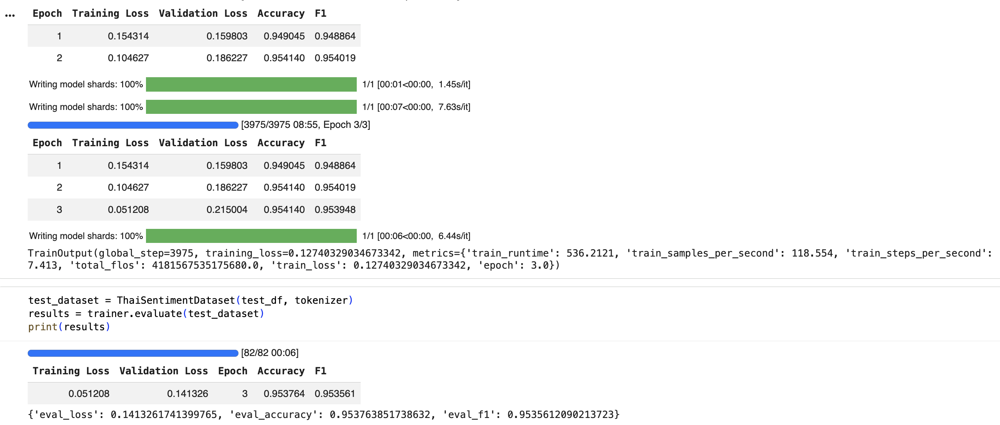
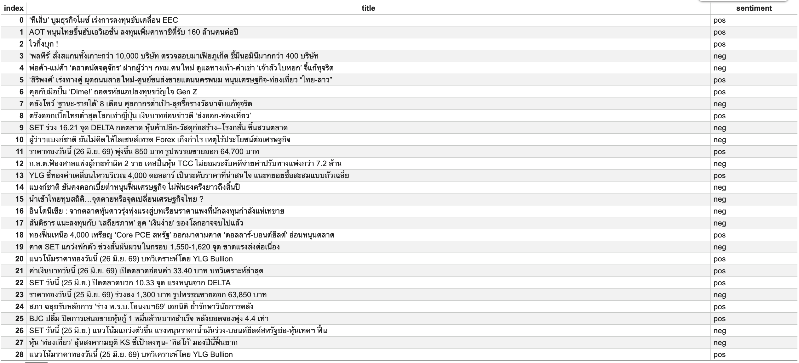

# Thai Financial News Sentiment Analysis with Explainability (SHAP)

A Thai NLP project that fine-tunes WangchanBERTa on financial news to classify sentiment (positive/negative/neutral) and explains predictions using SHAP.

## Project Overview

This project analyzes Thai financial news sentiment using a fine-tuned transformer model, then applies SHAP (SHapley Additive exPlanations) to interpret which words influence the model's predictions.

## Results

| Metric | Score |
|--------|-------|
| Test Accuracy | 95.38% |
| Test F1-Score | 95.36% |
| Training Data | 21,190 samples |

## Screenshots

### Training Results

### Financial News Sentiment

### SHAP Explanation

## Tech Stack

- **Model**: WangchanBERTa (`airesearch/wangchanberta-base-att-spm-uncased`)
- **Framework**: HuggingFace Transformers, PyTorch
- **Explainability**: SHAP
- **Data Collection**: feedparser, yfinance
- **Language**: Python (Google Colab)

## Pipeline

1. **Load & Clean Data** → Wisesight Sentiment dataset
2. **Fine-tune Model** → WangchanBERTa for 3 epochs
3. **Scrape News** → RSS feed from Prachachat.net
4. **Predict Sentiment** → Classify each news headline
5. **Explain with SHAP** → Visualize word-level contributions

## SHAP Explainability

SHAP values reveal which Thai words push sentiment toward positive or negative:
- **Positive signals**: หนุน, ลงทุน, รับ, เพิ่ม
- **Negative signals**: ร่วง, ขาดทุน, เทขาย

## Credits & Data Sources

### Dataset
- **Wisesight Sentiment Dataset**
  - Source: [PyThaiNLP/wisesight-sentiment](https://github.com/PyThaiNLP/wisesight-sentiment)
  - Provider: Wisesight (Thailand) Co., Ltd.
  - License: **CC0 1.0 Public Domain** — free to use and distribute
  - Contributors: PyThaiNLP community

### Pretrained Model
- **WangchanBERTa**
  - Source: [airesearch/wangchanberta-base-att-spm-uncased](https://huggingface.co/airesearch/wangchanberta-base-att-spm-uncased)
  - Provider: AI Research Institute of Thailand (AIResearch) / VISTEC
  - Paper: *WangchanBERTa: Pretraining Transformer-based Thai Language Models* (2021)

### News Data
- **Prachachat.net** (ประชาชาติธุรกิจ)
  - Source: RSS Feed (public)
  - URL: https://www.prachachat.net/feed

### Stock Market Data
- **Yahoo Finance** via `yfinance`
  - SET Index (^SET.BK)
  - Source: https://finance.yahoo.com
